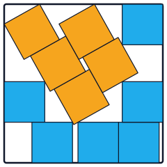

<p align="center">
  
</p>

# sqpack

`sqpack` is a Python package for searching for optimal packings of `n`
unit squares (freely rotatable) inside the smallest possible enclosing
axis-aligned square. It targets the best-known `s(n)` values catalogued
by [David Ellsworth](https://kingbird.myphotos.cc/packing/squares_in_squares.html),
using a feasibility-search and simulated-annealing pipeline written in
Python on top of Numba.

## Install

From GitHub:

```
pip install git+https://github.com/steventhornton/sqpack.git
```

For local development:

```
uv pip install -e .   # or:  pip install -e .
```

`uv` is recommended for development but is not a user requirement.

Requires Python 3.10 or later. Pulls in `numpy`, `numba`, and `matplotlib`.

## CLI quickstart

```
sqpack solve 11 --rotations 2 --numrotate 5 --time 300 -v
sqpack info output/sqpack_n_11_*.json
sqpack render output/sqpack_n_11_*.json -o n11.png
sqpack refine output/sqpack_n_11_*.json --rounds 200 -v
```

Every subcommand reads or writes the JSON layout documented in
`docs/output-schema.md`.

## Using sqpack from an agent

The repo ships with an `AGENTS.md` guide and two
[Claude Code](https://docs.claude.com/en/docs/claude-code/overview) skills
under `.claude/skills/`: `run-experiment` and `analyze-results`.

To use the skills without cloning the repo, install them with

```
npx skills add steventhornton/sqpack
```

You still need `pip install git+https://github.com/steventhornton/sqpack.git`
for the underlying CLI; the skills just teach the agent how to call it.

Alternatively, clone the repo and open it in Claude Code (or any agent
that respects `AGENTS.md`). Either way, you can then ask for runs in
natural language:

```
> Run a solve for n=11 with a 5 minute budget
> Render the latest n=11 result to a PNG
> How does the current best for n=17 compare to KNOWN_BEST?
```

Behind the scenes the agent invokes the same `sqpack` CLI documented
above. The `run-experiment` skill launches `sqpack solve` with sensible
defaults and tails the log; `analyze-results` summarizes a result JSON,
renders it, and compares it against `KNOWN_BEST`. Both are visible in
`.claude/skills/` if you want to copy or adapt them for a different
agent.

## Python quickstart

```python
from sqpack import solve, save_result, load_result, KNOWN_BEST

result = solve(11, n_rotations=2, numrotate=[5], time_limit=300, verbose=True)
save_result(result, "n11.json")
print(result.s, "vs known best", KNOWN_BEST[11])

r2 = load_result("n11.json")
```

## Pipeline at a glance

The pipeline shape is documented in detail in `docs/internals.md`. In
short: a cohort of feasible packings is collected at a fixed target side
length via `drop + compress` trials, the smallest realised bounding box
in the cohort is then `refine`-d (SA slides + angle bisection) and
`polish`-ed (theta scan), and the global best across cohorts is what
the JSON file tracks.

## Documentation

- `docs/cli.md` — every subcommand and every flag.
- `docs/python-api.md` — `solve`, `refine`, `polish`, `load_result`,
  `save_result`, `plot_packing`, `KNOWN_BEST`.
- `docs/output-schema.md` — the canonical v1 JSON layout.
- `docs/internals.md` — pipeline details and the Numba hot path.
- `AGENTS.md` — short LLM-facing guide.

## License

MIT. See `LICENSE`.
