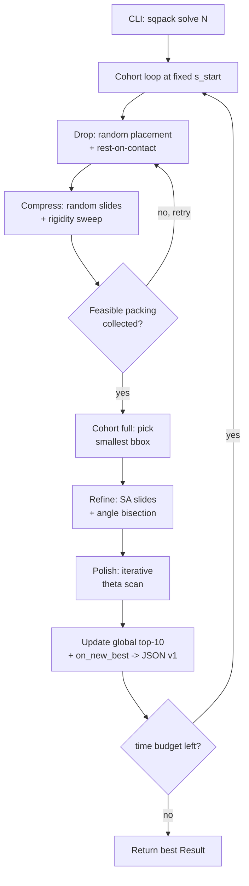

# sqpack internals

This document describes the live pipeline behind `sqpack solve`. It is
written against the current code in `sqpack/solver.py` and
`sqpack/refinement.py`.

## Pipeline overview



Every box in the diagram corresponds to live code. Anchors below.

## Key idea: target-based feasibility, not "drop and measure"

The solver does not drop into a free space and measure the resulting
bounding box. Instead it asks a yes/no question:

> "Can `n` unit squares fit inside a container of side `s`?"

A *trial* runs at a fixed target `s` and returns either a valid packing
inside `[0, s]^2` or failure. The outer loop varies `s` indirectly: every
trial measures the realised bounding-box side of the packing it produced
(`bounding_box_size` in `sqpack/geometry.py`), and the smallest realised
bbox in a cohort is the candidate that gets refined.

## Stage A: cohort-based feasibility search

Entry point: `solve()` in `sqpack/solver.py:422`. The driver loop is in
`solve()` lines ~475-568.

Each iteration of the outer loop builds one *cohort*:

1. Repeat trials at `s = s_start` (default `ceil(sqrt(n))`) until
   `cohort_size` (default 10) feasible packings are collected.
2. Sort the cohort by realised bbox; the smallest one feeds the refine
   stage.
3. Refine + polish that packing; compare against the current global best.
4. If improved, fire `on_new_best(...)` (which writes a v1 JSON via
   `sqpack.io.save_result`).
5. Repeat until `time_limit` is exhausted.

### A.1 Trial: drop

`_trial_feasibility_jit` (`sqpack/solver.py:86`). Numba-jitted, called
once per trial.

For each square `i = 0..n-1`:

- Sample one rotation from the trial's rotation set (built by
  `_build_feasibility_args` at `sqpack/solver.py:312`).
- Up to 100 attempts to place the square. Half the attempts drop along
  `+y` (`find_drop_y` in `sqpack/geometry.py:182`); the other half drop
  along a randomly chosen direction out of `+y`, `-x`, `-y`, `+x`
  (`_find_drop_x`, `_find_drop_y_from_below`, `_find_drop_x_from_left`
  in `sqpack/solver.py:38-78`).
- If no attempt lands inside `[h, s - h]^2` (where `h = (|cos| + |sin|)/2`
  is the rotated half-extent), the trial fails.

A successful drop phase yields `n` placed squares with at least one
contact per square.

### A.2 Trial: compress

Two sub-phases. Both keep walls at `s` and slide individual squares.

**Random exploration** (`solver.py:183-217`). For `n_compress_steps`
(default 1000) iterations: pick a random square, a random plane from the
trial's rotation set, a random one of four directions on that plane,
compute the maximum feasible slide `t_max`, and slide.

**Rigidity sweep** (`solver.py:240-280`). Cycle through every
`(square, plane, direction)` until a full pass moves no square. The
sweep uses the *actual* placed angles of the squares as planes (not the
sampled rotation set), because the placement step may have left
floating-point epsilon between sampled and stored angles.

After compression, an overlap check (`overlap_depth > 1e-6`) gates the
trial. If clean, the realised `bounding_box_size` is recorded.

### A.3 Cohort gate and refinement worker

Once `cohort_size` feasibles are collected, the cohort is sorted by
realised bbox and the smallest is handed to `_refine_worker`
(`solver.py:345`), which chains three refinement passes (see Stage B
below).

The refined packing is validated via `_validate_packing`
(`solver.py:409`) and, if it improves on the global top-10 or the
running best, recorded.

## Stage B: refine

`_refine_worker` (`solver.py:345`) runs three substages in order:

1. **`refine_with_slides`** (`refinement.py:419`)
   Multi-round, two-phase SA. Each round: `coarse_steps = 30%` of
   `sa_steps` at high temperature (`sa_t_start` down to `sa_t_start/10`),
   then `fine_steps = 70%` at low temperature (down to `sa_t_end`).
   Internally calls `_sa_optimize` (`refinement.py:144`, jit). Does not
   change `theta`.

2. **`refine_with_angle_bisection`** (`refinement.py:541`)
   Treats each distinct non-zero rotation angle as a search dimension.
   For each dimension, gridsearch over 5 candidate values across the
   current range, then narrow the range around the best by 4×. For
   3+ angle groups, sweeps each dimension independently to avoid
   combinatorial explosion. Each candidate is evaluated by *exploding*
   the packing by `explode_factor` (default 1.05), substituting the
   candidate angle, then re-compressing via `_feasibility_compress`
   (`refinement.py:300`, jit).

3. **`polish_theta`** (`refinement.py:732`)
   Final pass. Sweeps theta in degrees across a narrow range around the
   current angle (default `±1.0°`, 11 sample points). At each candidate
   theta the packing is exploded, rotated squares get the new theta, and
   `refine_with_slides` is rerun. The scan range is halved every
   iteration until below `convergence_tol` degrees (default 0.01°).
   Disabled by `--no-polish`.

## Result and JSON

The solver returns a `Result` dataclass (`sqpack/schema.py`). Every
intermediate best fires `on_new_best`, which builds the same dataclass
and serializes it through `sqpack.io.save_result` so the on-disk JSON
matches the v1 layout in `docs/output-schema.md`.

`refine_with_slides`, `refine_with_angle_bisection`, and `polish_theta`
are all reachable directly from the public API:

```python
from sqpack import refine_with_slides, refine_with_angle_bisection, polish_theta
```

## Numba hot path

The following functions are JIT-compiled and on the inner loop:

- `_trial_feasibility_jit` (`solver.py:86`) — entire drop+compress.
- `_find_drop_x`, `_find_drop_y_from_below`, `_find_drop_x_from_left`
  (`solver.py:38-78`).
- `overlap_depth`, `overlap_y_interval`, `overlap_x_interval`,
  `overlap_t_interval`, `slide_diagonal`, `find_drop_y`,
  `bounding_box`, `bounding_box_size` (`sqpack/geometry.py`).
- `_bbox_constrained_sweep`, `_coordinate_descent`, `_sa_optimize`,
  `_shrink_and_resolve`, `_feasibility_compress` (`refinement.py`).

Do not change these without microbenchmarking. The cache=True decorator
means Numba persists compiled artifacts under
`~/.numba_cache/...`; the first run after an edit pays the compile cost.

## Knobs that matter most in practice

From the current `solve()` signature:

- `--rotations` / `--numrotate`: dominates trial cost. `--rotations 2
  --numrotate K` is the standard configuration.
- `--cohort-size`: how patient the refine stage is. Higher = fewer but
  better-aimed refines.
- `--time`: wall-clock budget. Cohorts run until the budget runs out.
- `--workers`: serial trials only; the *cohort* runs single-threaded.
  Parallelism currently comes from multiple `sqpack solve` processes
  pointing at separate output dirs, not from `--workers`.

